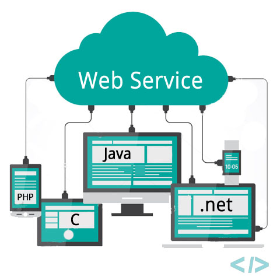
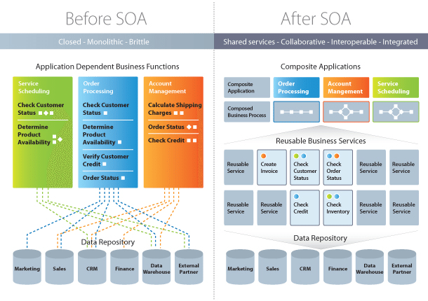

Web Services
=====================

Executar o web service
=====================

Instale as dependências
```ssh
mvn clean install
```
Suba o serviço
```ssh
mvn jetty:run
```

Tópicos
=====================

1. [Introdução](#1-introduction-to-web-service)
    - 1.1. [O que é Web Service?](#11-what-is-web-service)
    - 1.2. [Vantagens](#12-advantages-of-web-service)
    - 1.3. [Arquitetura de um Web service](#13-web-service-architecture)
    - 1.4. [Características dos Web Services](#14-web-service-features)
    - 1.5. [Como funciona?](#15-how-web-service-works)
    - 1.6. [Tipos de Web Service](#16-types-of-web-services)
    - 1.7. [Componentes](#17-components-of-web-services)

2. [Introdução ao SOAP ](#2-introduction-to-soap-web-services)
    - 2.1. [O que são SOAP Web Services?](#21-what-are-soap-web-services)
    - 2.3. [Desvantagens do SOAP](#23-disadvantages-of-soap-web-services)

3. [Introdução ao REST](#3-introduction-to-rest-web-services)
    - 3.1. [O que é uma REST API?](#31-what-is-rest-api)
    - 3.2. [O que são RESTful Web Services?](#32-what-are-restful-web-services)
    - 3.3. [Princípios da REST API](#33-principles-of-rest-api)
    - 3.4. [Características da REST API](#34-features-of-rest-api)
    - 3.5. [Métodos da REST API](#35-methods-of-rest-api)
    - 3.6. [Vantagens da REST API](#36-advantages-of-rest-api)

4. [SOAP Vs REST](#4-soap-vs-rest)
    - 4.1. [SOAP vs REST Web Services](#41-soap-vs-rest-web-services)


1 Introdução
=====================

1.1. O que é Web Service?
---------------------

**`Web Service é uma forma padronizada ou meio de comunicação`** entre cliente e servidor para troca de dados na Web.

**`Web Services fornece um protocolo/formato padrão`** que define a comunicação entre dois aplicativos.

**`Web Services fornecem uma plataforma comum`** que permite que vários aplicativos construídos em várias linguagens de programação se comuniquem e tenham a capacidade de se comunicarem entre si.




1.2. Vantagens
------------------
- **`Comunicação independente da plataforma`**: Web Services fornecem comunicação independente de plataforma/sistema operacional.
- **`Os aplicativos podem trocar dados`**: Por meio de Web Services, diferentes aplicativos podem se comunicar entre si e trocar dados/informações.
- **`Possui a capacidade de expor funcionalidades`** para outras aplicações existentes na rede 
- **`Interoperabilidade`** entre os aplicativos (Web Services permitem que vários aplicativos conversem/compartilhem dados e serviços entre si).
- Usam um **`protocolo padronizado`** para prover uma comunicação que todos entendam.
- **`Redução de custo`** de comunicação/Comunicação de baixo custo.

1.3. Arquitetura de um Web service
---------------------


A arquitetura de serviços dos Web Services consiste em três funções distintas, conforme fornecido a seguir:

1. **`Provedor de Serviço`**: O provedor cria/implementa o Serviço e o disponibiliza na internet para outro aplicativo cliente que deseja utilizá-lo.
2. **`Service Requestor`**: Requestor é um aplicativo consumidor/cliente que utiliza um serviço da web existente enviando uma solicitação XML. 
3. **`Service Registry/Broker`**: O registro é um diretório logicamente centralizado de serviços onde os desenvolvedores podem publicar novos serviços ou encontrar os existentes. O broker é um aplicativo que fornece acesso ao `UDDI (Universal Description, Discovery, and Integration)` que permite que o aplicativo cliente localize o serviço.

1.4. Características dos Web Services
---------------------

- **`Fracamente Acoplado`**: Cliente/Consumidor e o serviço não são fixos/vinculados um ao outro diretamente.
- **`Síncrono ou assíncrono`**: a sincronicidade especifica a vinculação do cliente à execução da função, os clientes assíncronos buscam seu resultado em um momento posterior, enquanto os clientes síncronos recebem seu efeito quando o serviço tem completado.
- **`Suporta RPC`**: os Web Services permitem que os consumidores invoquem procedimentos, funções e métodos em objetos remotos usando um protocolo RPC baseado em XML. 


1.5. Como funciona?
---------------------

<pre>
                  <strong>Client                          Server</strong>
                  sends REQUEST ->                <- gives RESPONSE
                  (Consume Services)              (Provide various services to use) 
                                [ ueses <strong>Medium</strong> - HTTP/INTERNET                 
                                <strong>Format</strong> - XML/JSON ]
</pre>
Explicação usando como base o SOAP:
- O programa cliente agrupa informações em uma mensagem SOAP que é enviada ao serviço da web como o corpo de uma solicitação HTTP POST
- O Web Service descompacta a solicitação SOAP e converte em um comando que o aplicativo pode entender e dá uma resposta com os dados/informações necessários
- A resposta dos pacotes do serviço é enviado  ao programa cliente em outra mensagem SOAP
- O programa cliente descompacta a mensagem SOAP e começa com o processo necessário


1.6. Tipos de Web Service
---------------------
Existem **principalmente** duas maneiras de implementar Web Services, os protocolos de serviços da Web populares são:

1. **`SOAP Web Services`**: `(Simple Object Access Protocol)`: [ *Medium*: HTTP (post), *Format*: XML ]
2. **`REST Web Services`**: `(REpresentational State Transfer)`: [ *Medium*: HTTP (get, post, put, delete), *Format*: XML/JSON/Text ]


1.7. Componentes
---------------------
1.7. Componentes: SOAP, WSDL, and UDDI
---------------------


Ao consumir Web Services, o cliente precisa saber:
- O que é o serviço?
- Quais são os diferentes serviços disponíveis?
- Quais são os vários componentes do Web Service?
- Qual é a estrutura e descrição do Web Service?
- Quais são os parâmetros de solicitação e resposta?
- Como chamar, usar e consumir o Web Service?

 


Normalmente os Web Services funcionam usando  alguns dos seguintes componentes:

1. **`SOAP (Simple Object Access Protocol)`**:
    - SOAP é uma recomendação W3C para comunicação entre aplicativos e formato para envio de mensagens
    - SOAP é um protocolo baseado em XML para acessar serviços da web e para trocar informações entre aplicações
    - SOAP é simples e extensível também uma plataforma, independente de linguagem

2. **`WSDL (Web Services Description Language)`**:
    - WSDL é uma linguagem baseada em XML para descrever serviços da web e como acessá-los
    - É uma interface baseada em XML para os Web Services que descreve todos os atributos e funcionalidades, nome do método/parâmetro do Web Service publicado
    - WSDL é o formato padrão para descrever um serviço da web que usa UDDI

3. **`UDDI (Universal Description, Discovery, and Integration)`**:
    - UDDI é um padrão baseado em XML para descrever, publicar, encontrar/descobrir e integrar Web Services
    - Um provedor de serviços da web publica seu serviço da web por meio de WSDL em um diretório/registro online de onde os consumidores podem consultar e pesquisar os serviços
    - UDDI é uma estrutura aberta e independente de plataforma que pode se comunicar via protocolo SOAP, CORBA e Java RMI


2 Introdução ao SOAP
=====================

2.1. O que são SOAP Web Services?
---------------------

- SOAP (Simple Object Access Protocol), uma recomendação W3C para comunicação entre dois aplicativos
- SOAP é um protocolo baseado em XML para acessar serviços da web em HTTP
- Qualquer serviço da Web que obedeça e siga algumas diretrizes que são conduzidas por ** especificações de serviços da Web SOAP ** é um serviço da Web SOAP

2.2. Introdução ao SOAP
---------------------

Existem duas categorias de especificações de SOAP Web Services: básica e estendida.
1. Básico
     - **SOAP**
       - Protocolo / Regras / Definições relacionadas a como dois aplicativos diferentes se comunicam na web
       - Toda a troca de mensagens / informações SOAP acontece com o formato comum: XML
         - As mensagens XML têm uma estrutura predefinida que consiste em Envelope, Header e Body
           - **Envelope**: elemento raiz de uma mensagem
           - **Header**: componentes, tipos complexos, parâmetros de autenticação
           - **Body**: solicitação real a ser enviada ao servidor
     - **WSDL (Web Services Description Language)**
     - **UDDI (Universal Description, Discovery, and Integration)**
2. Estendido
     - Web Services Security (WS-Security)
    - Web Services Policy (WS-Policy)


2.2. Desvantagens do SOAP
---------------------
- **Lento**: SOAP usa o formato XML, cuja parsing é lento e consome mais recursos e banda
- **WSDL dependent**: SOAP usa WSDL e não tem outros mecanismos para descobrir o serviço


3 Introdução ao REST
=====================

3.1 O que é REST API?
---------------------
- REST (REpresentational State Transfer) 
- REST é uma arquitetura ou estilo arquitetural
 - REST não é um protocolo, 
- REST é um princípio de design, pode-se usar alguns métodos de design para criar um serviço (**RESTful Web Services**)

REST é um estilo de arquitetura, bem como uma abordagem para fins de comunicação que é frequentemente usado no desenvolvimento de vários serviços na web
  - Introduzido por Roy Fielding no ano 2000
  - É frequentemente considerada como a `"linguagem da internet"`
  - É um modelo de cliente e servidor sem estado
  - REST é usado para construir serviços da Web que são leves, fáceis de manter e escalonáveis


3.2. O que são RESTful Web Services ?
---------------------

Qualquer serviço Web que obedeça algumas diretrizes da **REST API** é chamado de RESTful Web Service

3.3. Princípios da REST API
---------------------


Existem muitos princípios/restrições da arquitetura REST que um serviço Web precisa seguir para ser considerado como API REST ou RESTful Web Service:
1. **Interface Uniforme**:
    - **Resource** - Tudo é um recurso
      - qualquer plataforma, qualquer banco de dados, qualquer idioma - podemos criar um módulo ou recurso para alunos, funcionários ou qualquer coisa
    - **URI** - Qualquer recurso/dado pode ser acessado por um URI
      - URI = Identificador Uniforme de Recursos
      - http://domain.name/resource
      - http://website.com/students
      - https://website.com/employee/id=100
    - **HTTP** - Faz uso explícito de métodos HTTP
      - HTTP = protocolo de transferência de hipertexto
      - Os métodos HTTP são: GET, POST, PUT, DELETE
      - Usando métodos HTTP junto com URI, podemos requisitar e modificar qualquer recurso ou informação de recurso
2. **Cliente-Servidor**:
    - Cliente e servidor são entidades separadas, os clientes enviam REQUEST e recebem RESPONSES do servidor com cabeçalhos, status e corpo de resposta
3. **Stateless**:
    - Todas as comunicações cliente-servidor são sem estado
    - No caso de REST, o servidor não mantém nenhum estado do sistema e o cliente deve enviar uma solicitação completa (toda solicitação será independente e não dependerá de nenhuma solicitação anterior)
    - Cada solicitação do cliente ao servidor deve conter todos os dados necessários para tratar a solicitação, sem necessidade de armazenar nenhum dado no servidor
4. **Cache**:
    - O cache acontece no lado do cliente
    - O cliente usa o cabeçalho **Cache-Control** para determinar se deve armazenar o recurso em cache (fazer uma cópia local) ou não
    - O servidor gera respostas que indicam se eles podem ser armazenados em cache ou não para melhorar o desempenho, reduzindo o número de solicitações de recursos duplicados faz isso com a ajuda de **Cache-Control** e **Last-Modified (valor de data)**
5. **Sistema em camadas**:
    - Podem existir várias camadas entre o cliente e o servidor
    - As camadas podem incluir **Proxies**, **Gateways**, **Cache**, eles são intermediários HTTP
    - As camadas podem ser usadas para traduzir mensagens/melhorar o desempenho com cache, etc.
    - Permite segurança, balanceamento de carga e compartilhamento de cache para melhorar o desempenho do aplicativo
6. **Código On Demand**:
    - Capacidade de baixar e executar código no lado do cliente


3.4. Features of REST API
---------------------
- Mais simples do que a API SOAP
- Documentação adequada disponível
- Lança/registra mensagens de erro adequadas

3.5. Methods of REST API
---------------------

<pre>
- <strong>Creat</strong>        =   <strong>POST</strong> method
- <strong>Read</strong>         =   <strong>GET</strong> method  
- <strong>Update</strong>       =   <strong>PUT</strong> method
- <strong>Delete</strong>       =   <strong>DELETE</strong> method
</pre>

1. **`POST`** – Cria um novo registro usando o serviço da web RESTful
2. **`GET`** - Obtém uma lista de todos os dados
3. **`PUT`** - Atualiza os dados
4. **`DELETE`** - Deleta todos os dados


3.6. Vantagens da REST API
---------------------

- **Rápido**: devido a nenhuma especificação estrita como SOAP, REST consome menos largura de banda e recursos
- **Independente de linguagem e plataforma**: pode ser escrito em qualquer linguagem de programação e executado em qualquer plataforma
- **Permite diferentes formatos de dados**: Texto Simples, HTML, XML e JSON

4 SOAP Vs REST
=====================

4.1. SOAP vs REST Web Services
---------------------

| SOAP Web Services/API               | REST Web Services/API               |
| ------------------------------------| ----------------------------------- |
| SOAP stands for **`Simple Object Access Protocol`** | REST stands for **`REpresentational State Transfer`** |
| SOAP is a **`protocol`**            | REST is an **`architectural style`** |
| SOAP can't use REST because it is a protocol but REST is an architectural pattern                               | REST can use SOAP web services as it is an architectural pattern/concept and can use any protocol like HTTP, SOAP |
| SOAP uses **`service interfaces`** to expose the business logic | REST uses **`URI (URL path)`** to expose business logic |
| SOAP requires **`more bandwidth and resource`** than REST | REST requires **`less bandwidth and resource`** than SOAP |
| SOAP is **`slow`** as compared to REST | REST is **`fast`** as compared to SOAP |
| SOAP permits **`XML`** data format only | REST permits different data format such as **`Plain text, HTML, JSON, XML`** etc. |
| SOAP is **`less preferred`** than REST   | REST IS **`more preferred`** than SOAP |


[Texto adaptado](https://github.com/dinanathsj29/web-services-web-api-soap-rest-tutorial)


